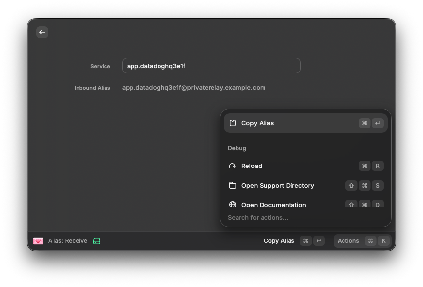
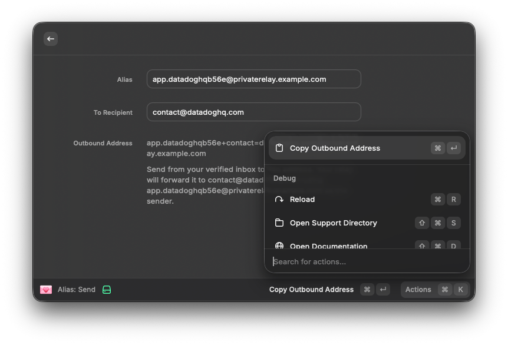

## 💌 Email Alias




Generate and manage email aliases for wildcard relay domains directly from Raycast, using the active browser tab as context.

## ⛳ Features

* **Alias: Receive** — generate an inbound alias for a service (e.g. `netflix3f2a@yourdomain.com`) based on the active browser tab. Give this address to a site when signing up.
* **Alias: Send** — construct an outbound address so you can reply or initiate email from an alias without exposing your real inbox. Uses the format `alias+recipient=domain@yourdomain`.

## 🔌 Relay Compatibility

The outbound address format follows the convention used by [Addy.io](https://addy.io). It also works with other wildcard alias relays that support the same outbound sending format, such as [Firefox Relay](https://relay.firefox.com).

## 🧬 Installation

* Install the [Raycast](https://www.raycast.com/) app
* Install the [Browser Extension](https://www.raycast.com/browser-extension) _(optional — pre-fills the service name from the active tab)_
* Install this plugin
  * `npm run build`
  * `Raycast` > `Import Extension` > `./dist`

## 🏗️ Development

* Node 22.5

```bash
npm install
npm test
npm run dev
```

## 🙋🏼 How to Use

1. Open the webpage you want to create an alias for.
2. Run **Alias: Receive** to generate an inbound alias to give to that site.
3. To reply or initiate email from an alias, run **Alias: Send**, enter your alias and the recipient, then copy the outbound address into your mail client's To field.

## ⛰️ Inspiration

* [💌 Alfred Email Generator](https://github.com/mxbaylee/email-generator)
